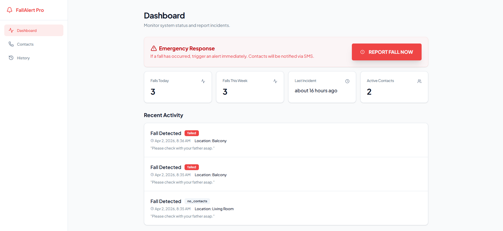
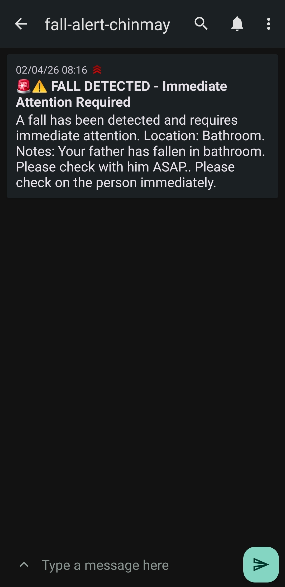

# Hackathon Project

Team Name: Algo-Rhythmists

## Project Title
Enhancing Elderly Safety: Real-Time Fall Detection and Automated Incident Reporting

## Problem Statement
Develop an AI-based system that assists elderly users in maintaining independence, safety and well-being through smart monitoring reminders and interactions.

## Solution
We developed a 3D pose-based fall detection system for elderly people. Developed a dashboard app that will send an SMS alert every time a fall is detected to the concerned person tagged with the location of the fall.

## ## Fall Detection Visualization

## Tech Stack
- Frontend: React, Vite, Tailwind CSS, shadcn/ui, TanStack React Query, Wouter, React Hook Form + Zod, Lucide React
- Backend: Python, Node.js, Express 5, Pino, Zod, ntfy.sh
- Database: Local storage

## How to Run
Run the `fall_detection.py` file to detect whether an elderly person has fallen or not by uploading a recorded video to the UI.

## Demo link
https://fall-alert-system--audichinmay1010.replit.app/

## Screenshots

## Team Members
1. Chinmay Bhangale, Team Lead, NITK Surathkal  
2. Nishant Sahu, Team Member, NITK Surathkal  

## Original Repository
[Team Algo Rhythmists Project](https://github.com/AdvayaBGSCET/team-algo-rhythmists)

---
*This repository is a fork to showcase my contributions during the hackathon. Original project uploaded by Chinmay Bhangale.*
